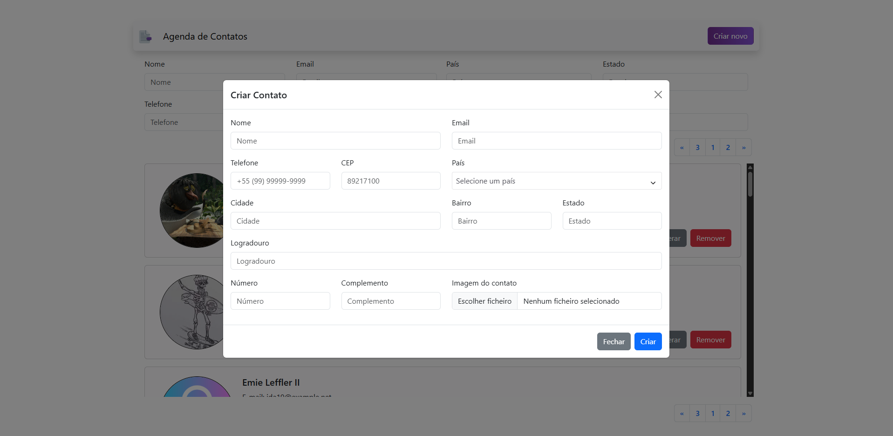
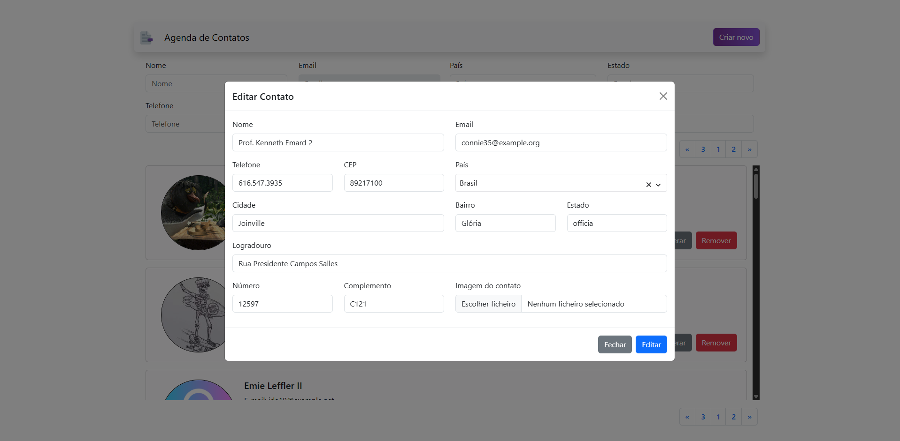

# Agenda de Contatos

Aplicação de cadastro de contatos (CRUD) construída com Laravel (PHP) no backend e Vue.js no frontend. Banco de dados SQL para persistência. Interface simples, responsiva e pronta para extensões.

## Tecnologias
- Backend: Laravel, PHP
- Frontend: Vue.js
- Banco de dados: MySQL / PostgreSQL / SQLite
- Autenticação básica, validação e API RESTful

## Funcionalidades
- Criar, ler, atualizar e excluir contatos
- Busca e paginação
- Upload de foto do contato
- API REST para integração com frontend em Vue.js
- Validações no servidor e no cliente

## Instalação rápida
Pré-requisitos: PHP, Composer, Node.js, NPM/Yarn, MySQL (ou outro SQL)

1. Clonar repositório
    ```
    git clone <repo-url>
    cd contact-book
    ```

2. Backend (Laravel)
    ```
    cd backend
    composer install
    cp .env.example .env
    php artisan key:generate
    # configurar .env com dados do banco
    php artisan migrate --seed
    php artisan serve
    ```

3. Frontend (Vue.js)
    ```
    cd ../frontend
    npm install
    npm run dev
    ```

4. Acessar a interface no navegador (porta conforme configuração)
5. O backend no docker pode levar até 1min para subir.

## Estrutura principal
- /backend — aplicação Laravel, rotas API, controllers, migrations
- /frontend — aplicação Vue.js, componentes, serviços API
- /docs — documentação adicional
- imagens no diretório raiz usadas neste README

## Exemplos visuais

Tela Principal:

Tela de cadastro de contato na agenda:

Tela de atualização de contato na agenda:


## Contribuição
- Abrir issues para bugs/feature requests
- Enviar PRs com descrição clara e commit smalls
- Seguir padrões de código do Laravel e Vue.js

## Licença
Projeto disponível sob licença MIT.